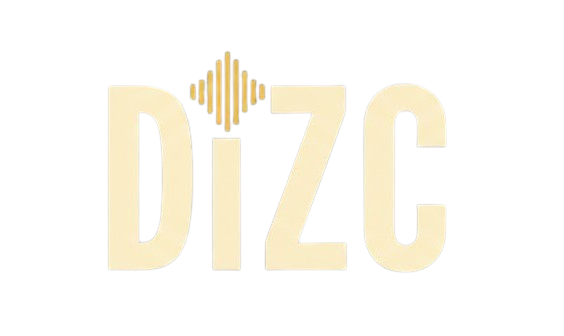

<div align="center">
  
  <br/>
  
</div>

# GhostAudio - High Fidelity Digital Music Library

**GhostAudio** is a standalone, high-fidelity music experience designed for audiophiles who want to own their music. It bridges the gap between physical media (CDs) and the modern digital cloud — rip a disc on your desktop and stream it from any browser minutes later.

---

## Key Features

### CD Ripping
Insert a disc, fetch metadata automatically from MusicBrainz, and rip tracks in lossless quality. The Python/Django backend handles optical drive communication and real-time per-track progress is streamed back to the UI.

### Local File Import
Import existing MP3, FLAC, WAV, and M4A files from your machine into your library with full metadata and cover art support.

### Cloud Audio Streaming (Cloudflare R2)
Ripped and imported tracks automatically upload to Cloudflare R2 object storage. Once uploaded, your tracks are available to stream from the web app on any device — no local files required.

### Unified Account (Desktop + Web)
One account works everywhere. Auth is backed by MongoDB so your desktop and web sessions share the same user ID, library, and playlists.

### Library & Album Browsing
Browse your collection by album with cover art fetched from the Cover Art Archive. Delete albums you no longer want.

### Playlists
- Create **manual playlists** and add any track from your library
- Create **smart playlists** that auto-populate by rule:
  - `by_artist` — all tracks by a given artist
  - `recently_added` — tracks from your 10 most recently imported albums
  - `random` — up to 50 randomly shuffled tracks
- Drag-and-drop to reorder tracks
- Refresh smart playlists anytime to pick up new imports

### Full-Featured Player
Queue, skip, seek, volume, and persistent queue that survives navigation within a session. Play an album, a playlist, or start from any individual track.

---

## Tech Stack

| Layer | Technology |
|---|---|
| Desktop shell | Electron |
| Frontend | Next.js 15 (App Router), React, TypeScript, Tailwind CSS |
| Backend | Django 5, Django REST Framework, Gunicorn |
| Database | MongoDB Atlas (PyMongo) |
| Auth | Custom JWT (pyjwt + bcrypt), shared between desktop and web |
| Audio storage | Cloudflare R2 (S3-compatible, via boto3) |
| CD ripping | ffmpeg (`libcdio` input driver) |
| Metadata | MusicBrainz / Cover Art Archive |
| Deployment | Vercel (web frontend), Railway (backend API) |

---

## Architecture

```
GhostRepo/
├── backend/                  # Django REST API
│   ├── config/               # Settings, URLs, WSGI
│   ├── importer/             # Views, CD ripping, R2 upload, playlists
│   │   ├── views.py          # All API endpoints
│   │   ├── services.py       # CDRipper class (ffmpeg wrapper)
│   │   └── cd_metadata.py    # MusicBrainz TOC lookup
│   ├── bin/                  # Bundled ffmpeg.exe
│   ├── requirements.txt
│   ├── Procfile              # Railway deployment
│   └── runtime.txt           # python-3.12
└── music-app/                # Next.js + Electron app
    ├── electron/
    │   ├── main.js           # Electron main process + IPC handlers
    │   ├── preload.js        # Secure context bridge
    │   └── services.js       # Fetch wrappers for the Django API
    └── src/
        ├── app/
        │   ├── dashboard/    # Main library view
        │   └── playlists/    # Playlist detail pages
        ├── components/
        │   ├── CDImporter.tsx
        │   ├── AlbumCard.tsx
        │   ├── AlbumDetailView.tsx
        │   ├── Sidebar.tsx
        │   ├── PlayerBar.tsx
        │   ├── PlaylistView.tsx
        │   ├── PlaylistCoverArt.tsx
        │   └── CreatePlaylistModal.tsx
        ├── context/
        │   ├── AuthContext.tsx
        │   ├── PlayerContext.tsx
        │   └── PlaylistContext.tsx
        └── services/
            └── api.ts        # IPC → fetch fallback for all API calls
```

---

## API Reference

All endpoints prefixed with `/api/`.

### Auth
| Method | Path | Description |
|---|---|---|
| POST | `mongo/auth/register/` | Create account |
| POST | `mongo/auth/login/` | Login, returns JWT |
| GET | `mongo/auth/me/` | Verify token, return user |

### Library
| Method | Path | Description |
|---|---|---|
| GET | `mongo/library/` | List albums for a user |
| DELETE | `mongo/albums/<id>/` | Delete an album |

### CD Ripping
| Method | Path | Description |
|---|---|---|
| GET | `cd-metadata/` | Fetch disc metadata from MusicBrainz |
| GET | `rip/stream/` | SSE stream — rip CD with live progress |

### Playlists
| Method | Path | Description |
|---|---|---|
| GET/POST | `mongo/playlists/` | List / create |
| GET/PATCH/DELETE | `mongo/playlists/<id>/` | Detail / update / delete |
| POST | `mongo/playlists/<id>/items/` | Append tracks |
| DELETE | `mongo/playlists/<id>/items/<index>/` | Remove a track |
| POST | `mongo/playlists/<id>/refresh/` | Re-run smart rule |

### Audio Upload
| Method | Path | Description |
|---|---|---|
| POST | `mongo/upload-audio/` | Upload file to Cloudflare R2, returns public URL |

---

## Local Development

### Prerequisites
- Python 3.12
- Node.js 20+
- MongoDB Atlas cluster
- Cloudflare R2 bucket *(optional — local file paths are used as fallback)*

### Backend

```bash
cd backend
python -m venv venv
venv/Scripts/pip install -r requirements.txt
venv/Scripts/python manage.py migrate
venv/Scripts/python manage.py runserver
```

API available at `http://127.0.0.1:8000`.

### Frontend (browser dev mode)

```bash
cd music-app
npm install
npm run dev
```

Open `http://localhost:3000`.

### Electron (desktop)

Start the Django backend first, then:

```bash
cd music-app
npx electron .
```

### Environment Variables

Create `music-app/.env.local`:

```env
# MongoDB
MONGODB_URI=mongodb+srv://<user>:<pass>@<cluster>.mongodb.net/<db>

# Auth
JWT_SECRET=<random-secret>

# Cloudflare R2 (leave blank to use local paths only)
R2_ACCOUNT_ID=
R2_ACCESS_KEY_ID=
R2_SECRET_ACCESS_KEY=
R2_BUCKET_NAME=dizc-audio
R2_PUBLIC_URL=https://pub-<hash>.r2.dev

# API (use Railway URL for production)
NEXT_PUBLIC_API_URL=http://127.0.0.1:8000
```

---

## Deployment

### Backend → Railway

1. Connect the repo to Railway, set the root to `backend/`.
2. Add environment variables: `MONGODB_URI`, `JWT_SECRET`, `R2_*` keys.
3. Railway picks up `Procfile` automatically and runs gunicorn.

### Web → Vercel

1. Connect `music-app/` to a Vercel project.
2. Set `NEXT_PUBLIC_API_URL` to your Railway backend URL.
3. Push to deploy.

### Desktop Installer

```bash
cd music-app
ELECTRON_BUILD=true npm run dist
```

`ELECTRON_BUILD=true` enables Next.js static export mode required for Electron's file-based page serving.

---

*Created by Felipe Cantu*
